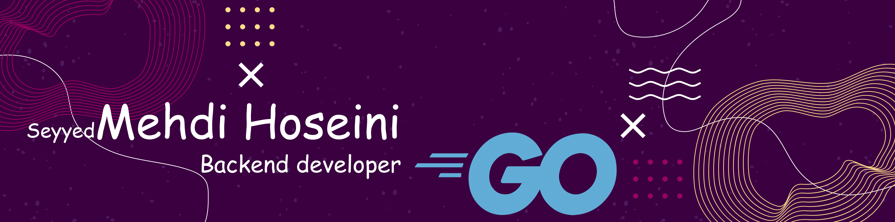

# Hi!! I'm  Mehdi Hoseini

<!-- HEADER -->
[](https://github.com/Mehdihoseinii)

## Info
```go
whoAmI := map[string]interface{}{
	"name":            "Seyyed Mehdi",
	"profession":      "Backend Developer",
	"location":        "Iran",
	"languages":       []string{"Go"},
	"databases":       []string{"PostgreSQL","MySQL"},
	"frameworks":      []string{"Gin"}
	"design":          []string{"Microservices"},
	"tools":           []string{"Docker", "Git"},
	"systems":         []string{"MacOS","Windows"},
}
``` 

## Let's connect! 
<!-- Hand shake:  -->

<div align="center">
<p align="center"></p>
<a href="https://www.twitter.com/Mehdihoseinii/" target="_blank">
    
</a>
	
<a href="https://www.linkedin.com/in/Seyyed_Mehdi_Hoseini/" target="_blank">
    
</a>


<a href="mailto:Mehdihoseiniorginal@gmail.com" target="_blank">
    
</a>

<a href="https://github.com/Mehdihoseinii/Mehdihoseinii/raw/main/CV.Mehdi.pdf">
	
</a>
</div>

